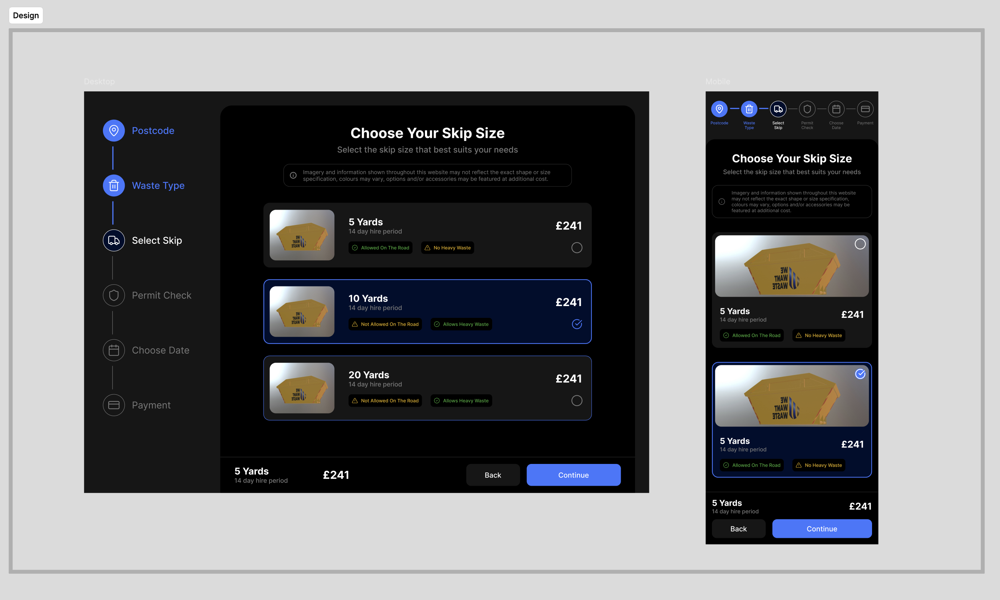
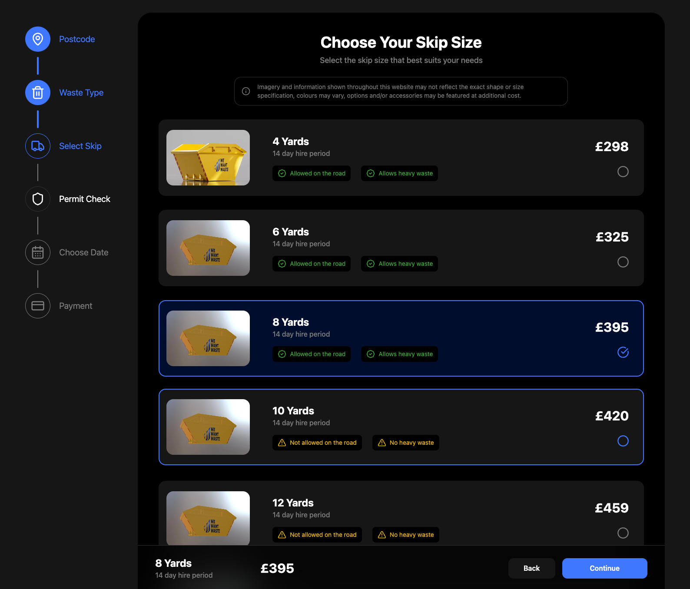

# Choose Skip Size Redesign

🌐 Live Site: [rem.raelcode.com](https://rem.raelcode.com)

🔗 Alternative Link: [Here](https://rem-cyan.vercel.app/)

## Project Overview

The Project focuses on redesigning the "Choose Skip Size" page of [wewantwaste's](https://wewantwaste.co.uk/) website to enhance the user experience, and responsiveness while maintaining the functionality.

The key goals include:

- Create a new, and improved UI/UX
- Make the page responsive for both desktop and mobile
- Focus on clean, and maintainable code

## Steps

The following outlines my approach to the project, and the sequential steps I followed.

### 1. Analyze the current user experience within the page

These are the key takeaways and areas of improvement:

- There is a significant amount of horizontal whitespace
- The steps navigation section is hidden when the user scrolls the skips list. This limits the user's sense of progress within the user journey.
- The steps navigation section is not responsive for mobile devices
- The price label has a low contrast ratio reducing its visibility

### 2. Create a redesign using Figma

Based on the above observations, I created a redesign using figma

🔗 Figma File: [Here](https://www.figma.com/design/ZoSNhWcErDyBbDuMGQdJAP/REM-Redesign?node-id=0-1&t=Iba2bNdEkSX7yfJT-1)



The following are the aspects of the page that have changed:

- I moved the steps navigation section to the left, and made it fixed so that it's always visible when the user scrolls.
- I changed the orientation of the step icon, and label to column for small devices.
- I added explicit tags for "Allowed on the road", and "Allows heavy waste"
- I changed the price label color to improve contrast ratio and visibility
- I made the skips list a one column grid, and reduced the image size to give more emphasis on the skip size, tags, and price.
- Having the bottom component with the preview and navigation buttons always visible, and instead disable the continue button if skip size is not selected.

### 3. Project Setup

After the design was complete, it was time to setup the react project. I chose to build the project using Vite.js bundler and Tailwind CSS.

To ensure consistency across all components, I setup a design system using css variables and Tailwind CSS @theme directive.

```css
@theme {
  /* Brand colors */
  --color-primary: #4077ff;

  /* Surface colors */
  --background-color-surface-default: #000000;
  --background-color-surface-secondary: #161616;
  --background-color-surface-highlight: #000d2d;

  /* Border colors */
  --border-color-default: #2f2f2f;
  --border-color-text-default: #ffffff;

  /* Text colors */
  --color-default: #ffffff;
  --color-subtitle: #7a7a7a;
  --color-on-primary: #ffffff;

  /* Support colors */
  --color-warning: #eab308;
  --color-success: #3ba936;
}
```

I then created the following reusable React.js components, and reusable classes while ensuring responsiveness across all screen sizes:

- Tailwind utility classes for buttons, tags, and different typography styles.
- Skip card component, and how it's rendered for each possible state ie. default, hovered, and selected
- Steps navigation component, and the specific step based on it's state (completed, current, active, disabled)

### 4. Project Development

With all the components ready, I integrated them to make up the main page ensuring the overall page layout adapts across various screen sizes.



For the components to work together, they needed to share state. For that I chose React's Context API to centralize the following states:

- Selected skip size, and update the footer component preview and enable the continue button.
- The current step within the navigation flow, and update both the page rendered, and the navigation component.

Finally, I added placeholders for the other steps within the system.

## How to run

To run this project locally:

### 1. Clone the repository

```shell
git clone https://github.com/kibzrael/rem
cd rem
```

### 2. Install Dependencies

```shell
npm install -g pnpm@latest-10
pnpm install
```

### 3. Start the development server

```shell
pnpm run dev
```

The application link will be displayed in the console (usually http://localhost:5173)
